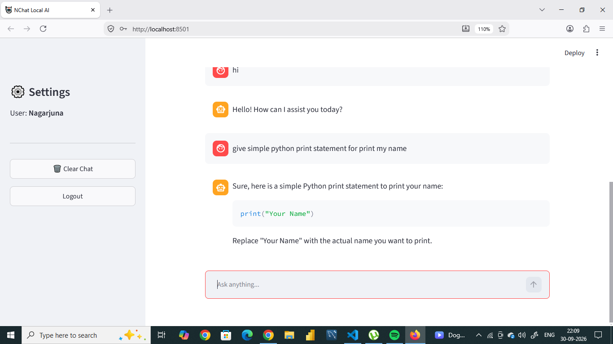
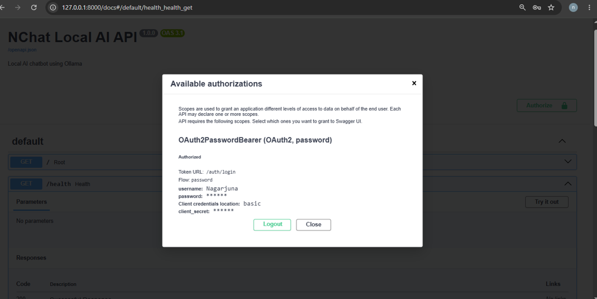

# 🤖 NChat - Local AI Chatbot

A full-stack local AI chatbot built using **Streamlit, FastAPI, SQLModel, SQLite, JWT Authentication, and Ollama**.

The chatbot uses the local **Qwen 2.5 3B** model through Ollama, so an OpenAI API key is not required.

---

## 🚀 Technologies Used

* Python
* Streamlit
* FastAPI
* SQLModel
* SQLite
* Ollama
* Qwen 2.5 3B
* JWT Authentication
* Pydantic
* Requests
* Python-dotenv

---

## ✨ Features

* User registration
* User login
* JWT authentication
* Local AI chatbot
* Ollama integration
* Qwen 2.5 3B model
* Chat history
* SQLite database
* SQLModel ORM
* Clear chat history
* Logout
* FastAPI REST API
* Streamlit frontend
* Swagger API documentation
* Environment variable configuration

---

# 📁 Project Structure

```text
Chatboot/
│
├── backend/
│   ├── __init__.py
│   ├── main.py
│   ├── database.py
│   ├── models.py
│   ├── schemas.py
│   ├── auth.py
│   ├── dependencies.py
│   ├── ollama_service.py
│   │
│   └── routes/
│       ├── __init__.py
│       ├── auth_routes.py
│       └── chat_routes.py
│
├── frontend/
│   └── app.py
│
├── data/
│
├── uploads/
│
├── .env
├── .gitignore
├── README.md
└── requirements.txt
```

---

# 🧩 Architecture

```text
                    USER
                      │
                      ▼
              ┌───────────────┐
              │   Streamlit   │
              │   Frontend    │
              └───────┬───────┘
                      │
                  HTTP Request
                      │
                      ▼
              ┌───────────────┐
              │    FastAPI    │
              │    Backend    │
              └───────┬───────┘
                      │
             ┌────────┴────────┐
             │                 │
             ▼                 ▼
       ┌───────────┐     ┌────────────┐
       │ SQLModel  │     │   Ollama   │
       │ + SQLite  │     │ Qwen 2.5   │
       └───────────┘     │    3B      │
                         └────────────┘
```

---

# 🔧 Prerequisites

Install the following before running the project:

1. Python 3.11+
2. Ollama
3. Qwen 2.5 3B model

Check Python:

```powershell
python --version
```

Check Ollama:

```powershell
ollama --version
```

---

# 🧠 Install Ollama Model

Download the Qwen 2.5 3B model:

```powershell
ollama pull qwen2.5:3b
```

Check installed models:

```powershell
ollama list
```

You should see:

```text
qwen2.5:3b
```

---

# 🐍 Create Virtual Environment

Open PowerShell inside the project folder:

```powershell
cd C:\Users\Dell\OneDrive\Desktop\Chatboot
```

Create virtual environment:

```powershell
python -m venv .venv
```

Activate it:

```powershell
.venv\Scripts\activate
```

After activation you should see:

```text
(.venv)
```

---

# 📦 Install Dependencies

Run:

```powershell
pip install -r requirements.txt
```

Or create `requirements.txt` with:

```text
fastapi
uvicorn[standard]
sqlmodel
python-jose[cryptography]
passlib[bcrypt]
python-multipart
python-dotenv
requests
streamlit
```

Then install:

```powershell
pip install -r requirements.txt
```

---

# 🔐 Environment Variables

Create a file named:

```text
.env
```

inside the project root:

```text
Chatboot/
└── .env
```

Add:

```env
DATABASE_URL=sqlite:///./chatbot.db

SECRET_KEY=my-super-secret-key-change-this

OLLAMA_URL=http://localhost:11434

OLLAMA_MODEL=qwen2.5:3b
```

### Important

`.env` is a **file**, not a folder.

Do not upload `.env` to GitHub because it can contain secret configuration values.

---

# 🗄️ Database

This project uses:

```text
SQLite
```

with:

```text
SQLModel
```

The database file will be created automatically when FastAPI starts.

The database will contain tables for:

* Users
* Chat messages

Example:

```text
chatbot.db
```

You do not need to manually create the database.

---

# ▶️ Running the Project

You need three terminals.

---

## Terminal 1 - Ollama

Start Ollama:

```powershell
ollama serve
```

If Ollama is already running, you don't need to start it again.

Check the model:

```powershell
ollama list
```

Make sure this model exists:

```text
qwen2.5:3b
```

---

# Terminal 2 - FastAPI Backend

Open PowerShell:

```powershell
cd C:\Users\Dell\OneDrive\Desktop\Chatboot
```

Activate the virtual environment:

```powershell
.venv\Scripts\activate
```

Start FastAPI:

```powershell
uvicorn backend.main:app --reload
```

You should see:

```text
Uvicorn running on http://127.0.0.1:8000
```

---

# 📚 FastAPI Swagger Documentation

Open:

```text
http://127.0.0.1:8000/docs
```

You can test the API from Swagger.

Available endpoints include:

```text
POST   /auth/register
POST   /auth/login

POST   /chat/
GET    /chat/history
DELETE /chat/history

GET    /
GET    /health
```

---

# Terminal 3 - Streamlit Frontend

Open another PowerShell:

```powershell
cd C:\Users\Dell\OneDrive\Desktop\Chatboot
```

Activate the virtual environment:

```powershell
.venv\Scripts\activate
```

Run Streamlit:

```powershell
streamlit run frontend/app.py
```

The application will normally open at:

```text
http://localhost:8501
```

---

# 🔑 User Registration

When you open the Streamlit application:

1. Select **Register**
2. Enter username
3. Enter password
4. Click **Create Account**

The user is stored in the SQLite database.

---

# 🔐 User Login

After registration:

1. Select **Login**
2. Enter username
3. Enter password
4. Click **Login**

FastAPI verifies the credentials and generates a JWT access token.

The token is then used when calling protected chat APIs.

---

# 💬 Chat Flow

When the user sends:

```text
What is Python?
```

the following process happens:

```text
Streamlit
    │
    ▼
POST /chat/
    │
    ▼
FastAPI
    │
    ├── Verify JWT
    │
    ├── Save user message
    │
    ├── Read chat history
    │
    ▼
Ollama
    │
    ▼
Qwen 2.5 3B
    │
    ▼
AI Response
    │
    ├── Save response to SQLite
    │
    ▼
FastAPI
    │
    ▼
Streamlit
```

---

# 🧠 Chat Memory

The application stores conversations in SQLite.

For example:

```text
User:
What is Python?

AI:
Python is a programming language.

User:
What are its uses?

AI:
Python is used for web development...
```

Previous messages are retrieved from the database and sent to Ollama as conversation context.

---

# 🧹 Clear Chat

The Streamlit sidebar contains:

```text
🗑️ Clear Chat
```

Clicking this deletes the logged-in user's chat history from the database.

---

# 🚪 Logout

Click:

```text
Logout
```

The Streamlit session is cleared and the user is returned to the login screen.

---

# 🔒 Authentication

The application uses:

```text
JWT
```

JSON Web Token is used to protect the chat APIs.

The basic flow is:

```text
Username + Password
        │
        ▼
FastAPI Login
        │
        ▼
JWT Token
        │
        ▼
Streamlit
        │
        ▼
Authorization Header
        │
        ▼
Protected API
```

Example authorization header:

```text
Authorization: Bearer <token>
```

---

# 🗂️ Important Files

## `backend/main.py`

Main FastAPI application.

Responsibilities:

* Create FastAPI app
* Configure CORS
* Create database tables
* Register routers
* Health endpoint

---

## `backend/database.py`

Database configuration.

Responsibilities:
ollama serve
* Create SQLite engine
* Create database tables
* Provide database session

---

## `backend/models.py`

SQLModel database models.

Contains:

```text
User
ChatMessage
```

---

## `backend/schemas.py`

Pydantic request and response schemas.

Examples:

```text
UserCreate
LoginRequest
TokenResponse
ChatRequest
ChatResponse
```

---

## `backend/auth.py`

Authentication functions.

Responsibilities:

* Password hashing
* Password verification
* JWT creation
* JWT verification

---

## `backend/dependencies.py`

FastAPI dependencies.

Used to verify the logged-in user.

---

## `backend/ollama_service.py`

Connects FastAPI with Ollama.

The Ollama API URL is:

```text
http://localhost:11434/api/chat
```

The configured model is:

```text
qwen2.5:3b
```

---

## `backend/routes/auth_routes.py`

Authentication APIs:

```text
POST /auth/register
POST /auth/login
```

---

## `backend/routes/chat_routes.py`

Chat APIs:

```text
POST /chat/
GET /chat/history
DELETE /chat/history
```

---

## `frontend/app.py`

Streamlit frontend.

Responsibilities:

* Registration
* Login
* Chat UI
* Chat history
* Logout
* Clear history
* FastAPI communication

---

# 🛠️ Troubleshooting

## Ollama model not found

If you get:

```text
model not found
```

check:

```powershell
ollama list
```

Make sure:

```text
qwen2.5:3b
```

exists.

If not:

```powershell
ollama pull qwen2.5:3b
```

---

## FastAPI connection error

If Streamlit shows:

```text
Cannot connect to FastAPI
```

make sure this is running:

```powershell
uvicorn backend.main:app --reload
```

Check:

```text
http://127.0.0.1:8000
```

---

## Streamlit doesn't start

Make sure you are in:

```text
Chatboot
```

and run:

```powershell
streamlit run frontend/app.py
```

Do not run:

```powershell
streamlit run app.py
```

because `app.py` is inside the `frontend` folder.

---

## Import error

Run FastAPI from the **Chatboot root directory**:

```powershell
cd C:\Users\Dell\OneDrive\Desktop\Chatboot
```

Then:

```powershell
uvicorn backend.main:app --reload
```

---

# 📌 Git

Initialize Git:

```powershell
git init
```

Check files:

```powershell
git status
```

Add files:

```powershell
git add .
```

Commit:

```powershell
git commit -m "Initial NChat chatbot project"
```

---

# 🚫 Files Not Uploaded to GitHub

The `.gitignore` file prevents files such as:

```text
.venv/
.env
__pycache__/
*.db
```

from being committed.

---

# 🎯 Project Learning Outcomes

This project demonstrates practical knowledge of:

* Python
* REST APIs
* FastAPI
* Streamlit
* SQLModel
* SQLite
* Pydantic
* JWT authentication
* Password hashing
* API integration
* Local LLMs
* Ollama
* Prompt/message handling
* Chat history
* Environment variables
* Git/GitHub

---

# 🚀 Future Improvements

The project can later be extended with:

* Streaming AI responses
* Temperature control
* Multiple Ollama models
* File upload
* PDF chatbot
* RAG
* Vector database
* Embeddings
* LangChain/LlamaIndex
* Admin dashboard
* User profile
* Chat sessions
* Conversation titles
* WebSocket streaming
* Deployment

---

# 👨‍💻 Author

**Nagarjuna**

Project:

**NChat - Local AI Chatbot**

Built with:

```text
Python
Streamlit
FastAPI
SQLModel
SQLite
Ollama
Qwen 2.5 3B
```

---
Screenshot for frontend aplication :
--------------------------------------

ScreenShot for authorizations,OAuth2PasswordBearer,(OAuth2,password)
----------------------------------------------------------------------



